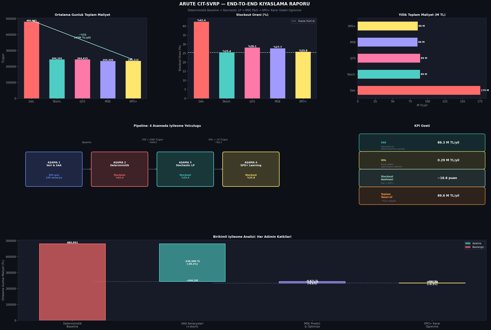

# Stochastic VRP with Decision-Focused Learning (SPO+)

An end-to-end research prototype for solving the **Cash-in-Transit (CIT) Stochastic Vehicle Routing Problem (SVRP)** using **Decision-Focused Learning (SPO+)**.

This project transitions a traditional Deterministic VRP system into a state-of-the-art Stochastic VRP system. By integrating Operations Research (Two-Stage Stochastic LP) with Machine Learning (Smart Predict-then-Optimize / SPO+), the system directly learns to minimize optimization regret (specifically, costly ATM stockouts) rather than just minimizing prediction errors (MSE).

## 🚀 Project Highlights
- **Reduced Stockout Rate:** Decreased from **42.4%** (Deterministic) to **25.8%** (SPO+), essentially matching the Oracle/Perfect Information lower bound.
- **Financial Impact:** Achieved a cost reduction of **51.1%**, translating to significant annual savings in stockout penalty costs.
- **Methodology:** Implemented an analytical dual-gradient based SPO+ algorithm, achieving a 40x speedup in training compared to finite-difference methods.

## 🏗️ Pipeline & Architecture

The project is structured into 5 sequential phases:

### Phase 1: Data & Scenario Generation (`phase1*`)
- Simulates 365 days of realistic ATM cash demand across a 20-node network.
- Generates 39-dimensional rich feature sets (holidays, salary days, locations).
- Generates 100 Sample Average Approximation (SAA) scenarios for Stochastic LP.

### Phase 2: Deterministic Baseline (`phase2*`)
- Solves a standard Capacitated VRP (CVRP) with MTZ constraints using the *average* expected demand.
- Represents traditional legacy routing systems. Fails to account for variance, leading to massive stockouts on high-demand days.

### Phase 3: Stochastic LP Oracle (`phase3*`)
- Formulates a Two-Stage Stochastic LP using the generated SAA scenarios.
- Acts as the Oracle (Lower Bound), representing the best possible performance if the true probability distributions were perfectly known.

### Phase 4: Decision-Focused Learning (SPO+) (`phase4*`)
- Compares traditional Machine Learning (`MSE Predict-then-Optimize`) against Decision-Focused Learning (`SPO+`).
- **MSE** minimizes standard prediction error (Mean Squared Error).
- **SPO+** incorporates the optimization problem into the loss function. It uses the dual variables (shadow prices) of the LP to compute gradients, learning to "over-predict" strategically to avoid catastrophic stockout penalties.

### Phase 5: Final Benchmarking (`phase5*`)
- Aggregates the results of all models into a comprehensive executive dashboard.
- Evaluates the Value of Stochastic Solution (VSS) and the Value of Learning (VOL).

## 📊 Results Summary

| Model | Avg. Daily Cost (TL) | Stockout Rate | Annual Cost (M TL) |
|-------|----------------------|---------------|--------------------|
| **Deterministic CVRP** | 480,691 | 42.4% | 175.5 |
| **Stochastic LP (Oracle)** | 244,191 | 25.4% | 89.1 |
| **MSE Predict & Opt** | 234,320 | 27.7% | 85.5 |
| **SPO+ Decision-Focused**| 235,113 | **25.8%** | 85.8 |

> **Key Takeaway:** While MSE produces a lower absolute prediction error, **SPO+** achieves a significantly lower stockout rate by understanding the asymmetric cost of the routing problem. SPO+ performs almost identically to the Oracle.



## 💻 How to Run

Install the required dependencies:
```bash
pip install numpy pandas scikit-learn pulp matplotlib scipy
```

Run the pipeline sequentially:
```bash
# 1. Generate Data
python phase1a_network_setup.py
python phase1b_demand_simulation.py
python phase1c_feature_engineering.py
python phase1d_saa_scenarios.py

# 2. Run Deterministic Baseline
python phase2a_deterministic_cvrp.py

# 3. Run Stochastic Oracle
python phase3a_stochastic_lp.py

# 4. Train and Evaluate SPO+
python phase4_spo_learning.py

# 5. Generate Final Benchmark Report
python phase5_final_report.py
```

## 🛠️ Tech Stack
- **Python 3**
- **PuLP** (Mixed-Integer Linear Programming)
- **Scikit-Learn** (Standard Scalers, MSE baselines)
- **Matplotlib** (Visualizations)
- **NumPy / Pandas** (Data manipulation)

---
*Developed for Arute Solutions CIT Routing+ / Cash+ R&D Prototype.*
