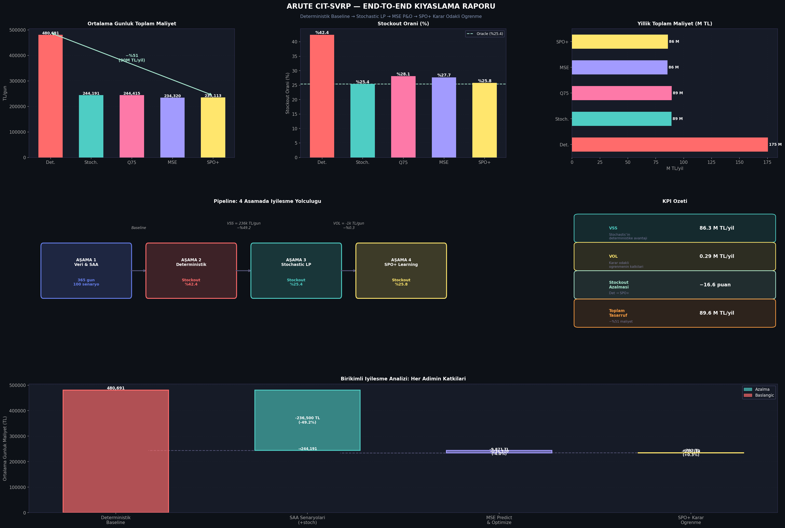

# Stochastic VRP with Decision-Focused Learning (SPO+)

An end-to-end research prototype for solving the **Cash-in-Transit (CIT) Stochastic Vehicle Routing Problem (SVRP)** using **Decision-Focused Learning (SPO+)**.

This project transitions a traditional deterministic VRP system into a stochastic VRP system. By integrating Operations Research (Two-Stage Stochastic LP) with Machine Learning (Smart Predict-then-Optimize / SPO+), the system directly learns to minimize optimization regret (specifically, costly ATM stockouts) rather than just minimizing prediction error (MSE).

## 🚀 Project highlights

- **Reduced stockout rate:** decreased from **42.4%** (deterministic) to **25.8%** (SPO+), essentially matching the Oracle / perfect-information lower bound.
- **Financial impact:** achieved a cost reduction of **51.1%** on the synthetic benchmark, translating to significant savings in stockout penalty costs.
- **Methodology:** implemented an analytical dual-gradient SPO+ algorithm, achieving a 40x training speedup compared to finite-difference methods.

## 🏗️ Pipeline & architecture

The project is structured into 5 sequential phases.

### Phase 1 — Data & scenario generation (`phase1*`)
- Simulates 365 days of realistic ATM cash demand across a 20-node network.
- Generates a 39-dimensional feature set (holidays, salary days, location effects).
- Generates 100 Sample Average Approximation (SAA) scenarios for the stochastic LP.

### Phase 2 — Deterministic baseline (`phase2*`)
- Solves a standard Capacitated VRP (CVRP) with MTZ constraints using the *average* expected demand.
- Represents a traditional, point-forecast routing approach. Fails to account for demand variance, leading to large stockouts on high-demand days.

### Phase 3 — Stochastic LP oracle (`phase3*`)
- Formulates a two-stage stochastic LP using the generated SAA scenarios.
- Acts as the Oracle (lower bound), representing the best possible performance if the true demand distribution were perfectly known in advance.

### Phase 4 — Decision-focused learning, SPO+ (`phase4*`)
- Compares a traditional ML approach (`MSE predict-then-optimize`) against decision-focused learning (`SPO+`).
- **MSE** minimizes standard prediction error (mean squared error).
- **SPO+** incorporates the optimization problem directly into the loss function. It uses the dual variables (shadow prices) of the LP to compute gradients, learning to "over-predict" strategically where it matters, to avoid costly stockout penalties.

### Phase 5 — Final benchmarking (`phase5*`)
- Aggregates the results of all models into a single comparison report.
- Evaluates the Value of the Stochastic Solution (VSS) and the value added by decision-focused learning.

## 📊 Results summary

| Model | Avg. daily cost (TL) | Stockout rate | Annual cost (M TL) |
|---|---|---|---|
| Deterministic CVRP | 480,691 | 42.4% | 175.5 |
| Stochastic LP (Oracle) | 244,191 | 25.4% | 89.1 |
| MSE predict & optimize | 234,320 | 27.7% | 85.5 |
| **SPO+ decision-focused** | 235,113 | **25.8%** | 85.8 |

**Key takeaway:** while the MSE model produces a lower absolute prediction error, SPO+ achieves a meaningfully lower stockout rate by accounting for the asymmetric cost structure of the routing problem (under-forecasting is far more expensive than over-forecasting). SPO+ performs almost identically to the Oracle, despite never having perfect knowledge of the demand distribution.



## 💻 How to run

Install dependencies:

```bash
pip install numpy pandas scikit-learn pulp matplotlib scipy
```

Run the pipeline sequentially:

```bash
# 1. Generate data
python phase1a_network_setup.py
python phase1b_demand_simulation.py
python phase1c_distribution_fitting.py
python phase1d_saa_scenarios.py

# 2. Deterministic baseline
python phase2a_deterministic_cvrp.py

# 3. Stochastic LP oracle
python phase3a_stochastic_loading.py

# 4. Train and evaluate SPO+
python phase4_spo_learning.py

# 5. Final benchmark report
python phase5_final_report.py
```

## 🛠️ Tech stack

- Python 3
- PuLP (mixed-integer / linear programming)
- scikit-learn (scalers, MSE baselines)
- Matplotlib (visualizations)
- NumPy / Pandas (data manipulation)

## ⚠️ Notes & limitations

All results are computed on **synthetic data** generated to mimic realistic CIT/ATM demand patterns (salary-day effects, weekend effects, location variance). They are intended to demonstrate the methodology — stochastic VRP formulation and decision-focused learning — rather than to represent any specific real-world deployment. Absolute figures (cost, stockout rate, savings) should not be read as production estimates; the relative ordering between approaches (stochastic > deterministic, SPO+ > MSE) is the result that's consistent with the broader literature on decision-focused learning.

## Robust Route Selection Branch Result

This branch tests whether a sector-aware stochastic decision layer can select different route candidates for different domain objectives on X40 CVRPLIB proxy-demand benchmarks. These are OR-Tools-only, proxy-demand results; they are not solver-agnostic or real-sector-demand claims.

### TUR 1 — Post-hoc score sensitivity

`mean_total_cost` produced no domain-specific route choice: 0 / 28 winner-producing instances. Post-hoc re-ranking suggested a possible signal for `mean_domain_loss` and `stockout_rate`, but that was not yet a real rerun.

### TUR 2 — Real score-metric experiments

`mean_domain_loss` and `stockout_rate` were rerun as first-class X40 experiments with full-scenario winner confirmation. They did produce domain-specific route winners:

| Score metric | Domain-specific instances | Certified domain-specific instances | Ranking flip rate |
| --- | ---: | ---: | ---: |
| `mean_total_cost` | 0 / 28 | 0 / 17 | 39.3% |
| `mean_domain_loss` | 7 / 28 | 5 / 14 | 50.0% |
| `stockout_rate` | 6 / 28 | 3 / 14 | 50.0% |

### TUR 3 — Risk isolation

The open question was whether certified diversity came mostly from fragile high-risk instances. Risk isolation split X40 into `anchor_feasible_medium_risk` and `high_risk_or_anchor_infeasible`.

| Score metric | Medium-risk certified diversity | High-risk certified diversity |
| --- | ---: | ---: |
| `mean_domain_loss` | 3 / 12 | 2 / 2 |
| `stockout_rate` | 3 / 13 | 0 / 1 |

**Sonuç:** clean signal exists. Certified domain-specific choice is not only a high-risk artifact.

### TUR 4 — Medium-risk candidate pool + tie-breaker

Because risk isolation passed, the medium-risk subset was tested with 5 added seeded OR-Tools route variants and a stockout-drift tie-breaker over near-tied `mean_domain_loss` candidates. The installed OR-Tools build does not expose a native `random_seed` field, so the variants use reproducible seeded search-cost perturbation while reporting true route cost on the original distance matrix.

| Test | Candidate feasible rows | Certified domain-specific instances | Ranking flip rate | Strict-safe rows |
| --- | ---: | ---: | ---: | ---: |
| Medium-risk baseline `mean_domain_loss` | 360 | 3 | n/a | n/a |
| Seeded candidate pool | 700 | 0 | 12 / 24 | 45 / 96 |
| Seeded pool + stockout-drift tie-breaker | 700 | 10 | 11 / 24 | 52 / 96 |

### TUR 5 — Cost-controlled tie-breaker on X40

The tie-breaker was made cheaper with route caching, chunked execution, and a near-tie tolerance sweep. On the medium-risk subset, `0.5%` was the best trade-off:

| Tolerance | Near-tied candidates | Certified domain-specific instances | Ranking flip rate | Strict-safe rows |
| --- | ---: | ---: | ---: | ---: |
| `0.1%` | 164 | 6 / 12 | 10 / 24 | 52 / 96 |
| `0.5%` | 321 | 11 / 16 | 7 / 24 | 66 / 96 |
| `1.0%` | 440 | 10 / 13 | 11 / 24 | 52 / 96 |

The selected `0.5%` tolerance was then applied to the merged X40 seeded candidate pool:

| Scope | Winner-producing instances | Certified domain-specific instances | Ranking flip rate | Strict-safe rows |
| --- | ---: | ---: | ---: | ---: |
| Full X40 seeded pool | 28 | 14 / 19 | 8 / 28 | 78 / 112 |
| Medium-risk subset | 24 | 11 / 16 | 7 / 24 | n/a |
| High-risk / anchor-infeasible subset | 4 | 3 / 3 | 1 / 4 | n/a |

Cost result: `0.5%` required 482 full-LP confirmation rows on X40, versus 607 near-tied rows at `1.0%` tolerance, a 20.6% reduction. In this run, only 161 new full-LP confirmations were needed because the medium-risk confirmation cache was reused.

The fast drift proxy failed the safety gate. On full X40, thresholds from `0.10` to `0.30` had false-negative rates from 50% to 100%, so the proxy must not be used to skip full confirmation.

### Karar

Branch status: **NEAR_PASS/CONFIRMATION_HEAVY**.

The branch is still not a full PASS because full-LP confirmation remains mandatory and the seeded variants use search-cost perturbation rather than native OR-Tools random seeds. But the result is stronger than `KISMEN/STRONG_DIAGNOSTIC`: the cost-controlled `0.5%` tie-breaker improved certified diversity and reduced ranking flips on the full X40 winner-producing set.

## 🔬 Quantum Extension (Phase 2b–2f)

Phase 2 of this project goes beyond the classical CVRP baseline and explores whether
quantum algorithms can improve on it. The exploration is honest — no assumption that
quantum wins.

| Phase | What it does | Key finding |
|-------|-------------|-------------|
| 2b — QUBO formulation | Encodes 20-ATM CVRP as binary optimisation | **2,648 logical / 1.2M physical qubits** needed |
| 2c — QAOA simulator | NumPy statevector QAOA on 5-ATM demo | p=1 reaches −2.491, optimal is −2.610 |
| 2d — Comparison + bug fixes | 3 bugs found and fixed | λ validation, silent INFEASIBLE, ⟨H⟩ ≠ argmax |
| 2e — Resource estimation | Surface code fault-tolerant overhead | 449 physical / logical qubit, d=15 |
| 2f — Feasibility report | When can VRP be solved on quantum hardware? | Not before 2030–2035 at earliest |

**The three bugs discovered here became the design principles of the follow-up project.**

## 🔗 Related Research

**Theoretical extension →**
[quantum-knapsack-vrp-theory](https://github.com/jasstt/quantum-knapsack-vrp-theory)

The bugs discovered in Phase 2d of this project raised a deeper question:
*What is the minimum problem structure for which quantum advantage is theoretically possible?*

That question is investigated in the follow-up repository, which:
- Applies the three Phase 2d lessons from day one (`[L1]` λ validation, `[L2]` explicit feasibility, `[L3]` ⟨H⟩ vs argmax)
- Tests a hybrid classical+QAOA Knapsack solver (LP boundary = O(1) qubit)
- Empirically validates McClean et al. (2018) barren plateau scaling (`Var ∝ 2⁻ⁿ`, slope = −0.986)
- Classifies 7 problem types by QUBO encoding growth rate (O(n) vs O(n²) vs O(n²m))
- Derives the **Circularity Conjecture**: the problems where quantum sub-problems are small enough to be tractable are exactly the problems where classical LP already works well

**Intersection point:** `phase2f_quantum_feasibility_report.md` in this repo ↔ `knapsack/knapsack_theory.md §5` in the follow-up repo.

## 📄 License

This project is licensed under the MIT License — see the [LICENSE](LICENSE) file for details.

---

*An independent research exploration into CIT cash routing under demand uncertainty.*
